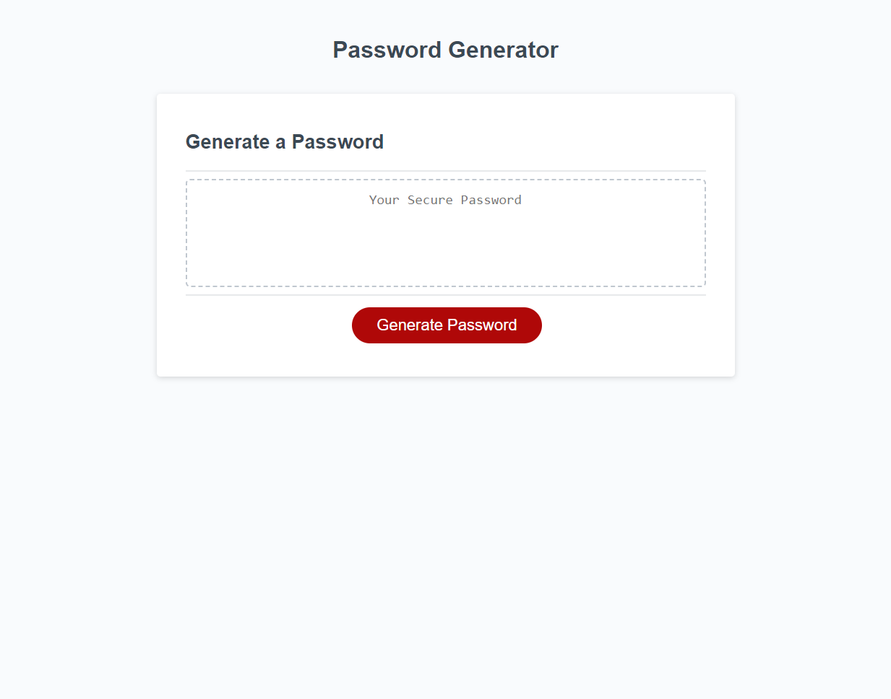

# 03-password-prompt

## Description

A basic website was presented in the form of an html document with CSS styling added.  An application tha would allow an employee to generate a random password based on criteria they've selected was requested.

## Website URL

https://chilejay7.github.io/03-js-password-prompt/ 

## Usage

A screenshot of the website design is included below for reference.  Clicking the "Generate Password" button will trigger the JavaScript function to begin a series of prompts for password criteria to the user would like to include.  Once all criteria have been selected, a random password will be generated in the bo

## Credits

Credit to Sean Brown-Byfield for help with updating the event listener to target my custom function.

## License

Please refer to the LICENSE in the repo.
